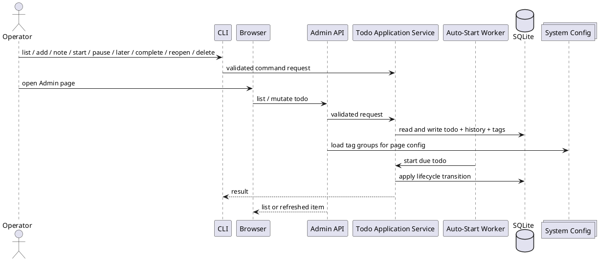
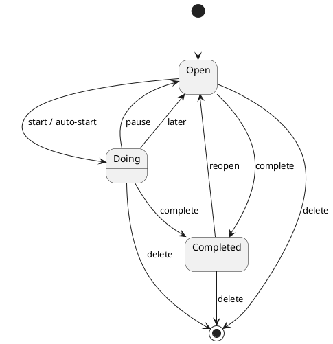
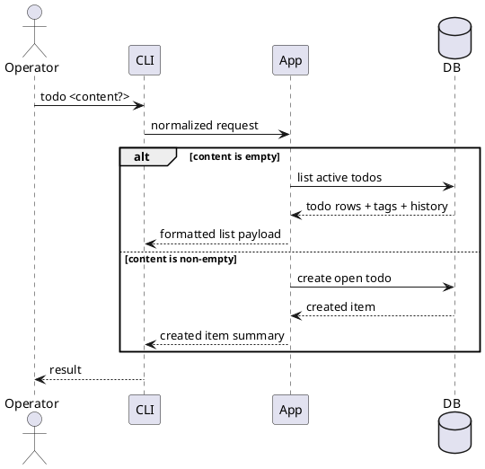
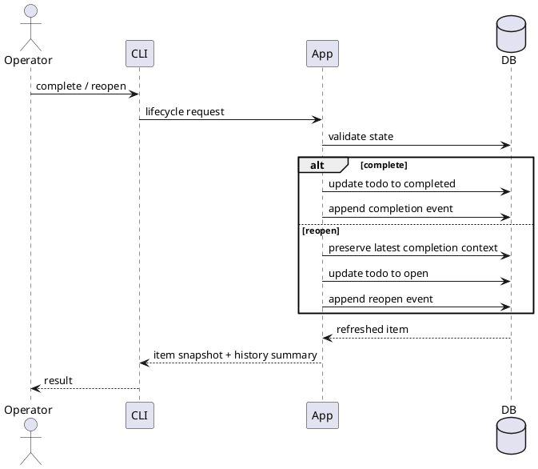
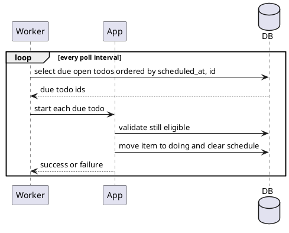

# Todo Module Technical Design

## 1. Overview

This document defines a standalone local todo system for individual operators. The system supports three surfaces:

- command-line interface
- Admin API
- Admin web UI

The requirement baseline is [Todo Module Requirements Spec](./spec.md).

The design principles are:

- local-first storage
- one shared lifecycle model across all surfaces
- Admin-first rich operations for search, tags, main links, and scheduling
- auditable history for all meaningful state and note changes
- the Admin UI is a first-class operating console rather than a demo page
- the Admin UI stays lightweight — backend-rendered page plus small amounts of native JavaScript

## 2. Goals

- Keep todo lifecycle behavior identical across CLI, Admin API, and Admin UI.
- Make the Admin UI efficient for daily todo triage and update.
- Support scheduled work and delayed resumption without introducing extra states.
- Preserve enough history to explain how a todo reached its current state.

## 3. Out of Scope

- chat or agent entrypoints
- remote collaboration
- multi-user synchronization
- cloud-backed storage
- team-wide assignment or permission model beyond Admin authentication

## 4. High-Level Architecture

The system consists of four parts:

- a local SQLite database at `$TODO_HOME/todo.db`
- a shared todo application service
- a CLI surface
- an Admin surface composed of JSON APIs and a server-rendered web page

All persistent data and configuration resides under a single data directory determined by the `TODO_HOME` environment variable. When `TODO_HOME` is not set, it defaults to `$HOME/.todo`. This directory contains:

| File | Purpose |
| --- | --- |
| `todo.db` | SQLite database for todos, tags, and history |
| `config.yaml` | Server port, auth token, tag groups, worker interval |
| `todo.pid` | PID file written by `make start`, removed by `make stop` |

The CLI and Admin surfaces both call the same application service. The application service owns validation, state transitions, history recording, and read-model hydration. The Admin UI adds only presentation logic such as modal editing, local filtering, compact or expanded cards, and toast feedback.

JavaScript is organized into five classes, each in its own template file loaded by `script.html`:

- **TodoApp** — main application class, manages overall state (allTodos, showCompleted, showDetails, selectedTagFilters, _detailStates), coordinates sub-modules, initializes polling
- **TodoAPI** — API communication class, encapsulates all fetch calls, token management, unified response parsing
- **TodoRenderer** — rendering class, handles renderList, renderCard, renderDetails and DOM operations
- **MainLinkModal** — modal class, manages main link modal open/close/submit
- **TodoToast** — toast notification class, displays success/error feedback

Each class is defined in its own `{{define "..."}}` template block in `templates/todo_*.html` and included via `{{template}}` directives in `script.html`.



## 5. Core Concepts

| Term | Meaning |
| --- | --- |
| Todo | A local work item tracked by content, state, timestamps, tags, and history |
| Note | A progress or context record that does not complete the todo |
| Completion Note | A note captured as part of completion |
| Main Link | A URL pointing to the main discussion related to the todo |
| Tag Group | A configured group that exposes candidate tags |
| Schedule Time | A future local datetime after which an open todo becomes eligible for auto-start |
| Later | A deferred-work action that moves a doing todo back to open and assigns its next schedule time |
| Doing List | The expanded list of active todos |
| Todo List | The main searchable backlog list |
| Todo Result | A feedback area showing the latest todo-action response |

## 6. Data Model

### 6.1 Entities

| Entity | Field | Meaning | Rule |
| --- | --- | --- | --- |
| `todo` | `id` | Todo identifier | Positive integer, immutable |
| `todo` | `content` | Main work description | Trimmed, non-empty |
| `todo` | `status` | Lifecycle state | `open`, `doing`, `completed` |
| `todo` | `created_at` | Creation time | Immutable |
| `todo` | `thread_link` | Related main link URL | Optional, clearable |
| `todo` | `scheduled_at` | Next eligible auto-start time | `0` means unset |
| `todo` | `completed_at` | Completion time | `0` when not completed |
| `todo_log` | `todo_id` | Owning todo | Required |
| `todo_log` | `action` | History event type | `start`, `pause`, `later`, `note`, `complete`, `reopen` |
| `todo_log` | `note` | Optional event payload | Used by note and completion events |
| `todo_log` | `created_at` | Event timestamp | Ordered descending in read views |
| `todo_tag` | `todo_id` | Owning todo | Required |
| `todo_tag` | `group_name` | Tag group | Trimmed, non-empty |
| `todo_tag` | `tag` | Selected tag value | Trimmed, non-empty |
| `todo_tag` | uniqueness | Unique pair | Unique per `todo_id + group_name + tag` |

### 6.2 Tag Group Configuration

Tag groups are defined in the system configuration file (not in SQLite). Each group contains:

| Field | Meaning | Rule |
| --- | --- | --- |
| `group_name` | Display name for the tag group | Trimmed, non-empty, unique |
| `tags` | Candidate tag list | At least one tag, each trimmed and non-empty |

The Admin UI reads tag groups from the system configuration at page-render time and renders them as group-name headers with selectable tag buttons.

### 6.3 View Models

| Model | Fields | Purpose |
| --- | --- | --- |
| `todo_summary` | `id`, `status`, `content`, time fields, `thread_link` | Card header and list row |
| `todo_detail` | `tags`, `note_logs`, `completion_logs` | Expanded Admin card |
| `todo_filter_state` | search query, selected tags | Browser-side filtering state |

### 6.4 Invariants

- `open` may have no schedule or one future schedule.
- `doing` must not retain an active schedule.
- `completed` must have `completed_at > 0` and `scheduled_at = 0`.
- Delete removes the todo, its history, and its tags as one logical operation.
- Reopen preserves prior completion context before clearing completion state.
- Later is distinct from pause in persisted history.

## 7. State Model

Supported states:

- `open`
- `doing`
- `completed`

Allowed transitions:

- `open -> doing` by Start or Auto-Start
- `doing -> open` by Pause
- `doing -> open` by Later
- `open -> completed` by Complete
- `doing -> completed` by Complete
- `completed -> open` by Reopen

State rules:

- Schedule can only be set, updated, or cleared while the todo is `open`.
- Later can only be used while the todo is `doing`.
- Complete always clears any remaining schedule.
- Start always clears any remaining schedule.



## 8. Lifecycle Workflows

### 8.1 Add or List via CLI

- If CLI input contains non-empty content, create a new open todo.
- If CLI input is empty or whitespace-only, list active todos (open + doing).
- Default listing excludes completed items unless explicitly requested.



### 8.2 Complete and Reopen

- Complete moves the todo into `completed`, stores `completed_at`, clears schedule, and may store a completion note.
- Reopen moves the todo back into `open` and preserves prior completion context in history.



### 8.3 Note and Note Deletion

- Add Note appends a note event without changing lifecycle state.
- Delete Note removes the visible note body but keeps the historical record slot so the timeline remains auditable.

## 9. Scheduling and Deferred Execution

### 9.1 Schedule

- Only open todos may set, update, or clear schedule.
- Empty schedule input clears the schedule.
- Scheduled time is stored as a resolved local datetime.

### 9.2 Later

- Later only applies to doing todos.
- Later requires a target time.
- Later performs three effects:
  - move `doing -> open`
  - set `scheduled_at`
  - append a `later` history event

### 9.3 Auto-Start Worker

- A background worker scans for due open todos.
- Due items are processed in ascending `scheduled_at` order.
- Each due item reuses the normal Start transition.
- The worker clears schedule as part of Start.
- Scan execution is bounded by batch size to prevent backlog starvation of foreground flows.



### 9.4 Timing Rules

- Quick offset buttons such as `+10m`, `+30m`, `+1h`, and `+1d` are UI helpers only.
- Persisted timing must always be a concrete local datetime.
- Validation errors must distinguish missing time, invalid time, and invalid state.

## 10. CLI Design

The CLI is a first-class surface for fast local operations. It exposes the same lifecycle semantics as Admin.

| Operation | Required Input | Optional Input | Result |
| --- | --- | --- | --- |
| `list` | none | `include_completed` | Returns ordered todo items |
| `add` | `content` | `thread_link`, `schedule_at` | Creates an open todo |
| `detail` | `id` | none | Returns one todo with tags and history |
| `note` | `id`, `note` | none | Appends a note event |
| `start` | `id` | none | Moves `open -> doing` |
| `pause` | `id` | none | Moves `doing -> open` |
| `schedule` | `id`, `schedule_at` | none | Sets, updates, or clears schedule on open todo |
| `later` | `id`, `schedule_at` | none | Moves `doing -> open` and sets next schedule |
| `complete` | `id` | `note` | Moves item to completed |
| `reopen` | `id` | none | Moves completed item to open |
| `delete` | `id` | none | Physically removes todo and dependent records |

CLI output rules:

- Default list output remains stable and ID-forward.
- Error messages explain state violations in operator language.
- Completion and reopen output includes enough context to confirm what changed.

## 11. Admin API Design

The Admin API serves both the Admin web UI and external local integrations. It returns refreshed read models after mutations so the UI can update without reload.

### 11.1 Read API

| Endpoint | Purpose | Query | Response |
| --- | --- | --- | --- |
| `GET /admin/api/todos` | Load todo lists | optional `include_completed` | `items`, `count`, `message` |

### 11.2 Mutation APIs

| Endpoint | Purpose | Request Body | Response |
| --- | --- | --- | --- |
| `POST /admin/api/todos` | Create todo | `content`, optional `thread_link`, optional `schedule_at` | `success`, `message`, refreshed `item` |
| `POST /admin/api/todos/{id}/note` | Add note | `note` | `success`, `message`, refreshed `item` |
| `DELETE /admin/api/todos/{id}/notes/{log_id}` | Delete note body | none | `success`, `message`, refreshed `item` |
| `POST /admin/api/todos/{id}/thread` | Set or clear main link | `thread_link` | `success`, `message`, refreshed `item` |
| `POST /admin/api/todos/{id}/tags` | Add tag | `group_name`, `tag` | `success`, `message`, refreshed `item` |
| `DELETE /admin/api/todos/{id}/tags/{tag_id}` | Remove tag | none | `success`, `message`, refreshed `item` |
| `POST /admin/api/todos/{id}/schedule` | Set, update, or clear schedule | `schedule_at` | `success`, `message`, refreshed `item` |
| `POST /admin/api/todos/{id}/later` | Postpone doing todo | `schedule_at` | `success`, `message`, refreshed `item` |
| `POST /admin/api/todos/{id}/start` | Start immediately | none | `success`, `message`, refreshed `item` |
| `POST /admin/api/todos/{id}/pause` | Pause active work | none | `success`, `message`, refreshed `item` |
| `POST /admin/api/todos/{id}/reopen` | Reopen completed todo | none | `success`, `message`, refreshed `item` |
| `POST /admin/api/todos/{id}/complete` | Complete todo | optional `note` | `success`, `message`, refreshed `item` |
| `DELETE /admin/api/todos/{id}` | Delete todo | none | `success`, `message` |

### 11.3 API Rules

- Empty `thread_link` clears the stored value.
- Duplicate tag selection is idempotent.
- Invalid state transitions return readable validation errors.
- Not-found behavior is explicit and does not silently no-op.

## 12. Admin UI Design

The Admin UI is the primary rich interaction surface. It is server-rendered with small amounts of native JavaScript for interactivity.

### 12.1 Page Structure

The Todo page contains the following major sections in order:

1. Page header
2. Doing List section
3. Todo List section
4. Last Result section — collapsible, hidden by default, shows the latest todo-action response

Doing List must appear above Todo List. Creating a todo is done via a New Todo modal triggered by a button in the Todo List header. English characters are rendered in a monospace font (`'Courier New', Consolas, 'Liberation Mono', monospace`).

### 12.2 Add Todo Section

A modal overlay with the following fields:

- `Content` multiline textarea
- `Main Link` text input (trimmed, no scheme validation)
- `Auto Start At` datetime-local input with quick offset buttons (`+10m`, `+30m`, `+1h`, `+1d`)
- Tag checkboxes organized by group when tag groups are configured

On success, the modal closes, the form resets, and the list refreshes. A `Cancel` button closes the modal without changes.

### 12.3 Doing List

Doing items are rendered in a dedicated list above the main Todo List. They are fully expanded by default and remain in this list until paused, moved to later, or completed. When no items are doing, the section shows empty-state text communicating that the doing list is empty.

### 12.4 Todo List Header and Toggles

The section title uses the format `Todo List (remains: N)` where N is the count of open (non-doing, non-completed) items.

The header exposes a **New Todo** button.

Two toggles are placed inline on the count line (`Showing N item(s).`):

- **Show completed todos** — controls whether completed items are included from backend data.
- **Show details** — expands all non-doing cards. Doing items remain expanded regardless of this toggle.

### 12.5 Search and Tag Filter Area

The search area appears above the main Todo List and contains:

- `Search Todo List` search input
- a hint text clarifying that search only filters the Todo List below
- a collapsible tag-filter panel with a `Filter By Tag` toggle button (default collapsed)

The tag-filter panel state is remembered in the session (`_tagFilterPanelOpen`). Search matches the following fields: todo ID, status, content, main link, tag group names, tag values, note text, note kind, note timestamp text, completion-note text, completion-note kind, completion-note timestamp text.

When expanded, the tag-filter panel appears only when configured tag groups exist. Each tag group must be rendered on its own line. When no filter is active, the panel explains that configured tags can narrow the list. When filters are active, the panel shows:

- active tag-filter count
- explanation that same-group selections behave as OR
- a `Clear filters` button

Tag-filter semantics: within the same group, multiple selected tags behave as OR; across different groups, selected tags behave as AND.

### 12.6 Counts and Empty States

The UI displays a second count line: `Showing N item(s).` This reflects the filtered Todo List, not the total dataset.

Empty-state messages distinguish three cases:

- no items in the Doing List
- no items in the Todo List
- no items matched the current filters

### 12.7 Todo Card Summary

Each todo card summary shows:

- `#id`
- `Status: ...`
- `Created: ...`
- `Auto Start: ...` when `scheduled_at` exists
- `Completed: ...` when `completed_at` exists
- main content in full (no truncation)
- if tags exist, a tag row showing selected tag chips (informational only)
- a main link row with `Main Link:` label, current link or empty-state copy, and an `Edit` button

Summary actions per state:

| State | Actions |
| --- | --- |
| `open` | `Start`, `Complete`, optional `Details`, `Delete` |
| `doing` | `Pause`, `Delete` |
| `completed` | `Reopen`, optional `Details`, `Delete` |

`Details` is hidden for doing items because they are always expanded. The quick `Complete` action is removed from doing items; completion is handled from the details panel.

### 12.8 Todo Card Details

The details area renders below the summary in this order:

1. Tags section
2. Notes section
3. Completion Notes section (when completion notes exist)
4. Add Note form (shared with Complete action)
5. Schedule or Later form depending on state

#### Tags Section

Existing tags render as `[group: tag]` chips in a single row (informational display only, no inline remove control). If no tags exist, the section shows `No tags.`. An `Edit Tags` button opens the **Edit Tags modal** when tag groups are configured.

The Edit Tags modal displays a **Selected Tags** area (informational, no remove button) and an **Available Tags** area organized by group. Available tag buttons toggle on click: selecting an unselected tag calls the add-tag API; deselecting a selected tag calls the remove-tag API. Changes are instant (no save button), and the modal content refreshes after each toggle.

#### Notes Section

Regular notes show timestamp text, kind text, and rendered note body. Notes are displayed in chronological order (oldest first). Each regular note exposes a `Delete` button. Completion notes show the same metadata and content shape but do not expose a delete button. Empty note lists show `None`.

### 12.9 Note and Completion Forms

- **Add Note form**: a multiline textarea, a `Save Note` button, and a `Complete Todo` button.
- `Complete Todo` uses the content of the shared textarea as the completion note.
- There is no separate `Completion Note` form.
- The summary-level `Complete` quick action on open items still works with an empty note.

### 12.10 Schedule and Later Forms

- **open items** — `Auto Start At` form with a narrow datetime-local input (`14rem`), a submit button whose label changes between "Save" and "Update" based on whether a schedule already exists, quick offset buttons `+10m`, `+30m`, `+1h`, `+1d` placed inline next to the input, and a hint that an empty value clears the schedule.
- **doing items** — `Later Until` form with a narrow datetime-local input (`14rem`), a `Later` submit button, quick offset buttons `+10m`, `+30m`, `+1h`, `+1d` placed inline next to the input, and a hint that later moves the todo back to open and auto-starts it at the selected time.
- **completed items** — neither schedule nor later forms are shown.

### 12.11 Main Link Modal

Clicking the `Edit` button in the summary main link row opens a dedicated modal. The modal contains:

- dynamic title including the todo ID
- hidden todo ID field
- `Main Link` text input
- hint that an empty value clears the link
- `Cancel` button
- `Save Main Link` button
- top-level `Close` button

On open, the input receives focus and its content is selected. The modal closes when: clicking the backdrop, pressing `Escape`, clicking `Close`, clicking `Cancel`, or after a successful save.

### 12.13 Timezone Handling

Schedule and later times are stored as UTC timestamps but must be displayed and edited in the user's local timezone.

- `toLocaleString()` displays stored timestamps in local time for read-only text.
- `datetime-local` input values must use local time; a `toLocalISO(date)` helper function adjusts the Date object by the timezone offset so `toISOString().slice(0, 16)` produces the correct local datetime string.
- When reading a `datetime-local` value, `new Date(val).getTime() / 1000` correctly interprets it as local time.
- The `toLocalISO` helper is defined globally alongside `escapeHtml` and used in all quick-offset and existing-schedule-value code paths.

### 12.12 Feedback Behavior

Every successful todo mutation:

- refreshes todo data
- updates the Todo Result section
- shows a success toast

Failed todo mutations show an error toast.

## 13. Service Management

The server process is managed through a Makefile with start, stop, and restart targets. A PID file at `$TODO_HOME/todo.pid` tracks the running instance. On start, if the PID file exists and the process is still running, the operation skips without starting a duplicate. On stop, the PID file is removed after the process exits.

## 14. Security

- Admin access requires one authenticated Admin boundary.
- Todo content, note content, and main links are treated as untrusted input.
- Main links must be clearable.
- UI rendering must escape or safely render all operator-provided text.
- Delete requires explicit operator intent and clear success feedback.

## 15. Observability

Recommended signals:

| Signal | Type | Purpose |
| --- | --- | --- |
| `todo_mutation_fail_total` | Counter | Track failing writes |
| `todo_list_latency_ms` | Histogram | Track list performance |
| `todo_scheduled_due_total` | Counter | Count due items discovered |
| `todo_auto_start_success_total` | Counter | Count successful auto-starts |
| `todo_auto_start_fail_total` | Counter | Count worker failures |
| `todo_later_total` | Counter | Distinguish postpone usage |

Suggested alert:

```yaml
todo_auto_start_failure:
  expr: rate(todo_auto_start_fail_total[10m]) > 0
  for: 15m
  severity: warning
```

## 16. Testing

Testing must cover:

- store-level data invariants
- lifecycle transition validation
- note and completion history behavior
- tag uniqueness and deletion
- schedule set, clear, and due processing
- later validation and later history recording
- CLI contract behavior
- Admin API contract behavior
- Admin UI list, filter, and card interaction behavior

## 17. Non-Functional Requirements

- Todo history must remain auditable after note deletion, completion, reopen, schedule update, and later.
- Auto-start behavior must be observable through explicit success and failure signals.
- The system is optimized for local operator-sized datasets.
- UI filtering should feel immediate for local datasets.

## 18. Risks and Open Points

| Topic | Design Position |
| --- | --- |
| Local scale | Optimized for operator-sized local datasets rather than large multi-tenant workloads |
| Bootstrap | Database schema and configuration defaults should initialize automatically on first startup |
| Delete | Physical delete is supported, so audit value comes from prior logs and explicit operator action |
| Time handling | All schedule input must resolve to one local timezone model |
| Future extension | If multi-user sync is needed later, the storage and auth model will need a separate redesign |
| Data directory | `TODO_HOME` defaults to `$HOME/.todo`, overridable via env var. Database, config, and PID file all live under this directory. |
| Service lifecycle | A Makefile with `start`, `stop`, `restart` targets manages the server process via the PID file at `$TODO_HOME/todo.pid`.
